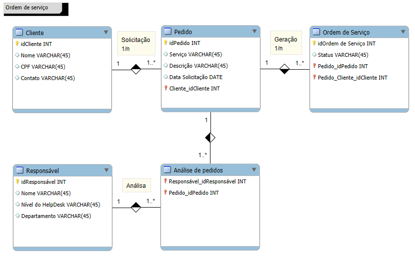

# Sistema de Ordem de Serviço - Introdução a Bancos de Dados

## 💻 Descrição do Projeto
Este projeto desenvolve um modelo de banco de dados relacional para um sistema de gestão de ordens de serviço. O objetivo é aplicar conceitos fundamentais de bancos de dados, como criação de tabelas, definição de chaves primárias e estrangeiras, além de garantir a normalização dos dados.

> **Status:**  Concluído  ✔️

## ✅ Conceitos Aprendidos
- **Modelagem de Banco de Dados Relacional:** Aprendizado sobre como estruturar e organizar dados de maneira eficiente em um banco de dados.
- **Chaves Primárias e Estrangeiras:** Entendimento de como as chaves primárias identificam registros únicos e as chaves estrangeiras fazem a conexão entre diferentes tabelas.
- **Normalização de Dados:** Aplicação da normalização para garantir a integridade dos dados e evitar redundâncias.
- **Relacionamentos entre Entidades:** Estudo dos tipos de relacionamentos como um para muitos e muitos para um, fundamentais para a integridade referencial do banco de dados.
- **Estruturas de Dados em SQL:** Uso de SQL para manipulação de dados e construção de consultas eficientes.

## 💻 Entidades e Atributos

### **Cliente**
- **idCliente (INT):** Chave primária, identificador único do cliente.
- **Nome (VARCHAR(45)):** Nome completo do cliente.
- **CPF (VARCHAR(45)):** Número de CPF do cliente.
- **Contato (VARCHAR(45)):** Informações de contato do cliente.

### **Pedido**
- **idPedido (INT):** Chave primária, identificador único do pedido.
- **Serviço (VARCHAR(45)):** Tipo de serviço solicitado.
- **Descricao (VARCHAR(45)):** Descrição detalhada do pedido.
- **DataSolicitacao (DATE):** Data em que o pedido foi realizado.
- **Cliente_idCliente (INT):** Chave estrangeira referenciando a tabela **Cliente**.

### **Ordem de Serviço**
- **idOrdemServico (INT):** Chave primária, identificador único da ordem de serviço.
- **Status (VARCHAR(45)):** Status atual da ordem de serviço (por exemplo, pendente, concluída).
- **Pedido_idPedido (INT):** Chave estrangeira referenciando a tabela **Pedido**.
- **Pedido_Cliente_idCliente (INT):** Chave estrangeira composta, referenciando **Pedido** e **Cliente**.

### **Responsável**
- **idResponsavel (INT):** Chave primária, identificador único do responsável.
- **Nome (VARCHAR(45)):** Nome completo do responsável.
- **NivelHelpDesk (VARCHAR(45)):** Nível de acesso ou função no help desk.
- **Departamento (VARCHAR(45)):** Departamento do responsável.

### **Análise de Pedidos**
- **Responsavel_idResponsavel (INT):** Chave estrangeira referenciando a tabela **Responsável**.
- **Pedido_idPedido (INT):** Chave estrangeira referenciando a tabela **Pedido**.

## 🤝 Relacionamentos
- Um **cliente** pode realizar muitos **pedidos**.
- Um **pedido** pode gerar uma ou mais **ordens de serviço**.
- Um **pedido** é realizado por um único **cliente**.
- Uma **ordem de serviço** está associada a um único **pedido**.
- Um **responsável** pode analisar vários **pedidos**.
- Um **pedido** pode ser analisado por um único **responsável**.

## 📊 Diagrama

---

## 🦶 Próximos Passos
1. **Implementação:** Criar o banco de dados e as tabelas em um SGBD como MySQL, PostgreSQL ou SQL Server.
2. **População:** Inserir dados de exemplo para testes.
3. **Consultas:** Desenvolver queries SQL para recuperar informações, como listar pedidos de um cliente ou ordens de serviço em aberto.
4. **Relatórios:** Criar relatórios para organizar e apresentar os dados.
5. **Melhorias:** Expandir o modelo com novas entidades e atributos, como histórico de alterações e métricas de desempenho.

---

## 👀 Observações
- Este modelo é um exemplo simplificado e pode ser adaptado para sistemas reais.
- A escolha dos tipos de dados (INT, VARCHAR, DATE) deve considerar os requisitos do sistema.
- A normalização é fundamental para evitar redundâncias e inconsistências.

---

## 🏁 CONCLUSÃO
Este projeto foi uma excelente oportunidade para aplicar conceitos básicos de bancos de dados relacionais, desde a criação de tabelas até a implementação de relacionamentos e normalização. A utilização de chaves primárias e estrangeiras foi essencial para garantir a integridade e organização dos dados. O modelo desenvolvido pode ser facilmente adaptado e expandido para sistemas mais complexos, oferecendo uma base sólida para futuras implementações.

---

🤖 "Programador: a única profissão onde você pode ganhar dinheiro quebrando coisas e depois consertando!" 😅
