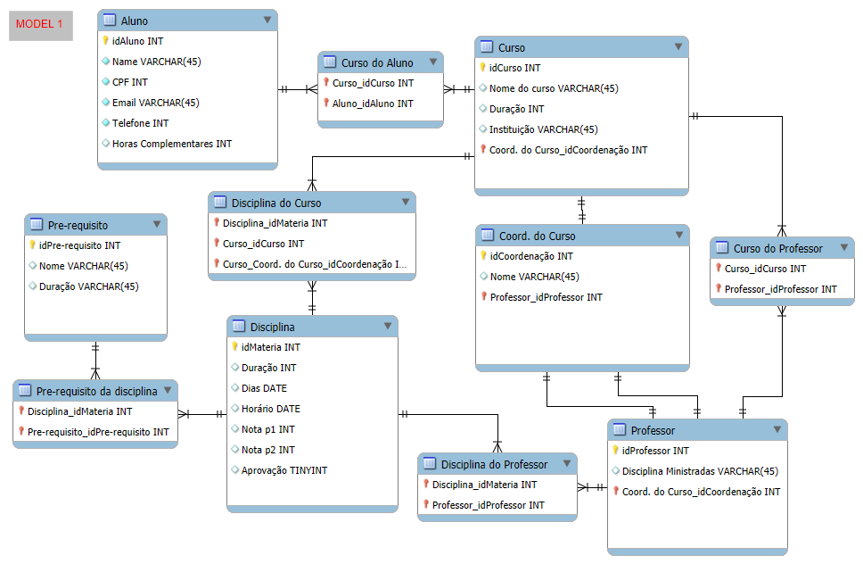
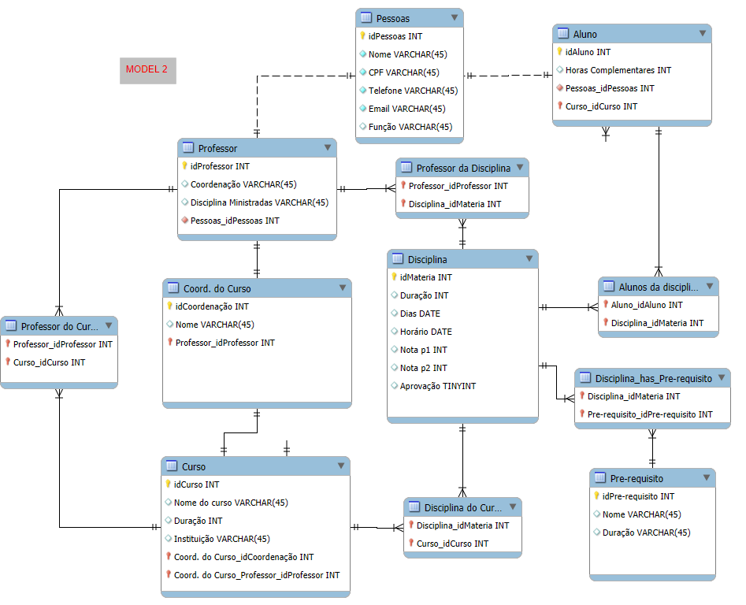

# Modelo de Banco de Dados para Sistema Acadêmico

## 📝 Descrição do projeto

Este projeto apresenta um modelo de banco de dados para um sistema acadêmico. O objetivo principal é organizar e estruturar as informações relacionadas a alunos, professores, cursos, disciplinas e seus respectivos relacionamentos. A modelagem foi realizada utilizando o diagrama EER (Enhanced Entity-Relationship) para maior clareza e detalhamento.

> **Status:**  Concluído  ✔️

## ✅ Conceitos Aprendidos

- Modelagem de banco de dados utilizando o diagrama EER.
- Estruturação de entidades, atributos e seus relacionamentos.
- Aplicação de conceitos de normalização para evitar redundâncias e inconsistências.
- Representação de tabelas intermediárias para resolver relacionamentos muitos-para-muitos.
- Definição de chaves primárias e estrangeiras para garantir a integridade referencial.
- Uso de atributos booleanos para otimização de entidades.

## 💻 Entidades e Atributos

### Aluno
- `idAluno` (INT) - Chave primária.
- `Name` (VARCHAR) - Nome do aluno.
- `CPF` (INT) - CPF do aluno.
- `Email` (VARCHAR) - Email do aluno.
- `Telefone` (INT) - Telefone de contato.
- `Horas Complementares` (INT) - Total de horas complementares do aluno.

### Professor
- `idProfessor` (INT) - Chave primária.
- `Disciplinas Ministradas` (VARCHAR) - Lista de disciplinas ministradas pelo professor.
- `Coord. do Curso_idCoordenacao` (INT) - Indica se o professor é coordenador de algum curso.

### Curso
- `idCurso` (INT) - Chave primária.
- `Nome do curso` (VARCHAR) - Nome do curso.
- `Duração` (INT) - Duração do curso em anos.
- `Instituição` (VARCHAR) - Instituição responsável pelo curso.
- `Coord. do Curso_idCoordenacao` (INT) - Chave estrangeira que referencia o coordenador.

### Disciplina
- `idMateria` (INT) - Chave primária.
- `Duração` (INT) - Duração da disciplina.
- `Dias` (DATE) - Dias em que a disciplina ocorre.
- `Horário` (DATE) - Horário das aulas.
- `Nota p1` (INT) - Nota da prova 1.
- `Nota p2` (INT) - Nota da prova 2.
- `Aprovação` (TINYINT) - Status de aprovação (booleano).

### Pre-requisito
- `idPre-requisito` (INT) - Chave primária.
- `Nome` (VARCHAR) - Nome do pré-requisito.
- `Duração` (VARCHAR) - Duração do pré-requisito.

## 🤝 Relacionamentos

- **Aluno e Curso**: Relacionamento muitos-para-muitos resolvido pela tabela intermediária `Curso do Aluno`.
- **Professor e Curso**: Relacionamento muitos-para-muitos resolvido pela tabela intermediária `Curso do Professor`.
- **Disciplina e Curso**: Relacionamento muitos-para-muitos resolvido pela tabela intermediária `Disciplina do Curso`.
- **Disciplina e Professor**: Relacionamento muitos-para-muitos resolvido pela tabela intermediária `Disciplina do Professor`.
- **Disciplina e Pré-requisito**: Relacionamento que estabelece os pré-requisitos para uma disciplina.

## 📊 Diagramas

---

## 🦶 Próximos Passos

- Implementar o modelo de banco de dados no MySQL.
- Testar a integridade dos dados com exemplos reais.
- Criar consultas SQL para popular e validar o banco de dados.
- Documentar as regras de negócio associadas ao sistema.

---

## 👀 Observações

- Este modelo é um exemplo simplificado e pode ser adaptado para sistemas reais.
- A escolha dos tipos de dados (INT, VARCHAR, DATE) deve considerar os requisitos do sistema.
- A normalização é fundamental para evitar redundâncias e inconsistências.

---

## 🏁 CONCLUSÃO

Este projeto foi desenvolvido para aplicar conceitos avançados de modelagem de banco de dados, com foco em integridade, organização e otimização do sistema. A partir do diagrama EER, conseguimos estruturar as entidades e seus relacionamentos de forma eficiente, criando um modelo sólido para um sistema acadêmico.

🤖 "Programação é como magia: você conjura soluções com palavras e números!"
