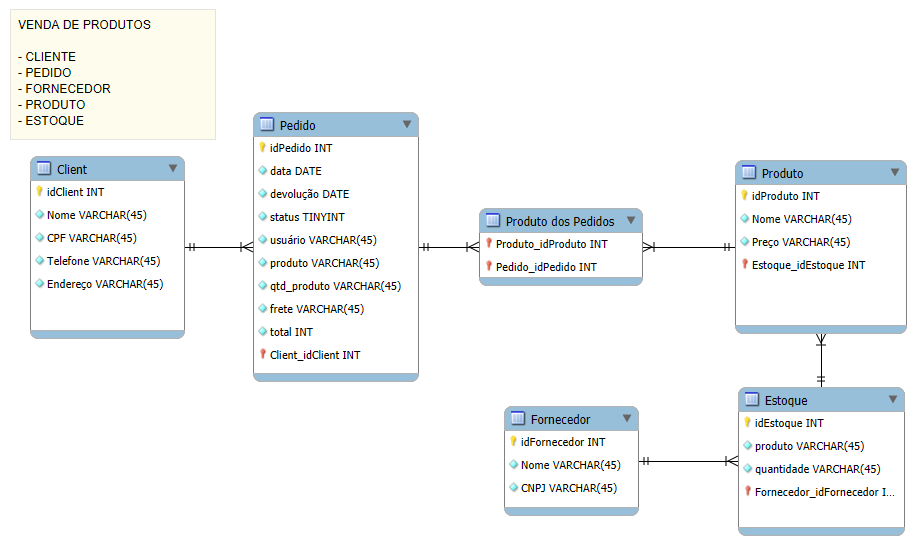

# Modelo de Banco de Dados para Sistema de Vendas

## 📝 Descrição do projeto

Este modelo de banco de dados foi projetado para gerenciar as operações de uma loja online ou física, abrangendo desde o cadastro de clientes e produtos até o processamento de pedidos e o controle de estoque.

## ✅ Conceitos Aprendidos

- Modelagem de banco de dados utilizando o diagrama EER.
- Estruturação de entidades, atributos e seus relacionamentos.
- Aplicação de conceitos de normalização para evitar redundâncias e inconsistências.
- Representação de tabelas intermediárias para resolver relacionamentos muitos-para-muitos.
- Definição de chaves primárias e estrangeiras para garantir a integridade referencial.
- Uso de atributos booleanos e índices para otimização de consultas.

## 💻 Entidades e Atributos

### Cliente
- `idCliente` (INT): Chave primária, identificador único do cliente.
- `Nome` (VARCHAR): Nome completo do cliente.
- `CPF` (VARCHAR): Número de CPF do cliente.
- `Telefone` (VARCHAR): Número de telefone do cliente.
- `Endereço` (VARCHAR): Endereço completo do cliente.
- `Email` (VARCHAR): Endereço de email do cliente.

### Pedido
- `idPedido` (INT): Chave primária, identificador único do pedido.
- `data` (DATE): Data do pedido.
- `devolução` (DATE): Data de devolução (se aplicável).
- `status` (TINYINT): Status do pedido (pendente, enviado, entregue, cancelado).
- `usuario` (VARCHAR): Usuário que processou o pedido.
- `produto` (VARCHAR): Produto(s) incluído(s) no pedido.
- `qtd_produto` (INT): Quantidade de cada produto no pedido.
- `frete` (DECIMAL): Valor do frete.
- `total` (DECIMAL): Valor total do pedido.
- `Client_idCliente` (INT): Chave estrangeira referenciando o cliente.

### Produto
- `idProduto` (INT): Chave primária, identificador único do produto.
- `Nome` (VARCHAR): Nome do produto.
- `Preço` (DECIMAL): Preço unitário do produto.
- `Estoque_idEstoque` (INT): Chave estrangeira referenciando o estoque do produto.

### Fornecedor
- `idFornecedor` (INT): Chave primária, identificador único do fornecedor.
- `Nome` (VARCHAR): Nome do fornecedor.
- `CNPJ` (VARCHAR): Número de CNPJ do fornecedor.

### Estoque
- `idEstoque` (INT): Chave primária, identificador único do estoque.
- `produto` (VARCHAR): Produto armazenado no estoque.
- `quantidade` (INT): Quantidade do produto em estoque.
- `Fornecedor_idFornecedor` (INT): Chave estrangeira referenciando o fornecedor do produto.

## 🤝 Relacionamentos

- **Cliente e Pedido**: Um cliente pode realizar muitos pedidos (um para muitos).
- **Produto e Pedido**: Um produto pode estar em muitos pedidos, e um pedido pode conter muitos produtos (muitos para muitos).
- **Produto e Estoque**: Um produto pode estar em um único estoque, e um estoque pode conter muitos produtos (um para muitos).
- **Produto e Fornecedor**: Um produto pode ser fornecido por um único fornecedor, e um fornecedor pode fornecer muitos produtos (um para muitos).

## 📊 Diagramas

---

## 🦶 Próximos Passos

- Implementar o modelo de banco de dados no MySQL.
- Testar a integridade dos dados com exemplos reais.
- Criar consultas SQL para popular e validar o banco de dados.
- Documentar as regras de negócio associadas ao sistema.

---

## 👀 Observações

- Este modelo é um exemplo base e pode ser adaptado para sistemas reais.
- A escolha dos tipos de dados (INT, VARCHAR, DATE) deve considerar os requisitos do sistema.
- A normalização é fundamental para evitar redundâncias e inconsistências.

---

## 🏁 CONCLUSÃO

Este projeto foi desenvolvido para estruturar e organizar operações relacionadas a sistemas de vendas, desde o cadastro até o controle de estoque. A modelagem busca garantir a integridade e eficiência, servindo como base para futuras expansões.

🤖 *"Bancos de dados são o coração de sistemas robustos!"*
